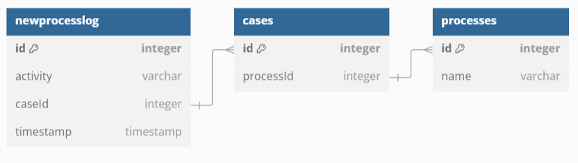

### TASK 3 - SOLUTION EXPLANATION ###

## Solution file ##
 migration.sql

1 case: n activities
1 process: n cases

We need to normalize the processlog table and create two new tables for cases and processes

-- Process(Id{PK}, Name)
-- Cases(Id{PK}, Pid(FK)) #bridge table
-- Activity(Id{PK}, Activity, Timestamp, Cid{FK})

## ERD ##

## Executable File ##
.read migration.sql
